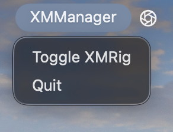
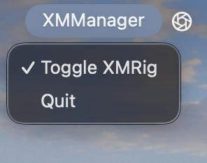

# xmmanager
XMManager is an easy way to manage XMRig on your mac. It currently allows you to toggle XMRig for easy use of the miner.

# Install
### Using prebuilt:
1. Download from releases
2. Download [XMRig](https://xmrig.com/download) and extract it to the same folder as XMManager 
	- Warning - XMRig can get flagged by your antivirus due to malicious programs using it to mine without permission. XMRig is a safe program.
3. Create a [config.json](https://xmrig.com/docs/miner/config) file and put it in the same folder as the rest. (command line arguments are not yet supported)
4. Run XMManager and have fun mining!
### From source:

I don't even remember at this point, too much debugging. I'll add CI soon so I'll update this part once I understand how I built it.

# Usage
Start the app first, then look at your menu bar. You should see a new entry called "XMManager". 
Click on it to open the menu.

Quit does as you would expect, it quits the program and also quits XMRig. Toggle XMRig, when you click it, either starts XMRig or kills it. When you click it, it changes to this:

The check mark signifies that XMRig is running. You can click it again and XMRig will be killed
And that is it! Have fun mining!
## This project is now on Codeberg

You can now find this project at [CodeBerg](https://codeberg.org/numycode/xmmanager/) instead.

Any use of this project's code by GitHub Copilot, past or present, is done without my permission.  I do not consent to GitHub's use of this project's code in Copilot.
